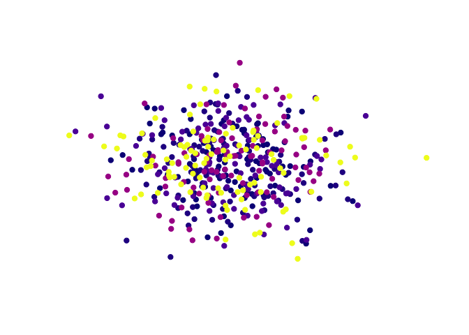

<!-- README.md is generated from README.Rmd. Please edit that file -->

# rpkgs

A skeleton for R packages + Docker / Pkgdown / Pages aimed for
Bioconductor


[](https://www.tidyverse.org/lifecycle/#maturing)

## Halp

Having trouble getting your package to build?

#### Build your Dockerfile locally

``` bash
docker build --tag montilab/rpkgs:latest .
```

Does it build successfully?

#### See if the package is loadable on the image

    docker run -i -t montilab/rpkgs:latest /bin/bash
    R
    library(rpkgs)
    data(example)
    print(example)

#### Build your github workflow file slowly and locally

    # Install this tool for local testing
    brew install nektos/tap/act
    
    # List the actions
    act -l
    
    # Run the default (`push`) event:
    act

## Documentation

Please visit <https://montilab.github.io/rpkgs/>

## Requirements

We recommend the latest version of R (\>= 4.0.0) but **rpkgs** currently
requires R (\>= 3.6.0) to be installed.

## Installation

Install the development version of the package from Github.

``` r
devtools::install_github("montilab/rpkgs")
```

## Usage

``` r
library(rpkgs)
```

``` r
data(example)
print(example)
```

    #> [1]  1  2  5 10 25

``` r
cols <- colorize(example)
print(cols)
```

    #> [1] "#0D0887FF" "#280592FF" "#5D01A6FF" "#A92395FF" "#F0F921FF"

``` r
visualize(cols)
```

<!-- -->

``` r
citation("rpkgs")
```

    #> 
    #> To cite rpkgs in publications use:
    #> 
    #>   A Skeleton R Package (2020) Monti Lab.
    #> 
    #> A BibTeX entry for LaTeX users is
    #> 
    #>   @Article{,
    #>     title = {A Skeleton R Package},
    #>     author = {Anthony Federico},
    #>     journal = {Monti Lab},
    #>     year = {2020},
    #>     volume = {1},
    #>     number = {1},
    #>     pages = {1-2},
    #>     url = {https://github.com/montilab/rpkgs},
    #>   }
